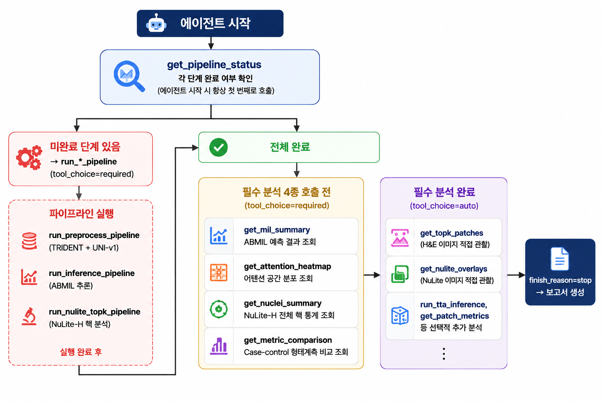

# WSI Toxicologic Pathology Screening Workbench

Local FastAPI web application for explainable rat liver H&E WSI toxicity screening.  
Connects ABMIL slide-level prediction, attention heatmap, NuLite-H nuclei analysis, case-control morphometrics, and a Qwen2.5-VL multimodal agent that autonomously runs the full pipeline and generates a Korean pathology report.

---

## Pipeline

| # | Stage | Model / Tool | Input | Output |
|---|---|---|---|---|
| 1 | **Preprocessing** | TRIDENT + UNI-v1 | WSI file | `features.h5` (N_patches × 1024) |
| 2 | **Slide Inference** | ABMIL | `features.h5` | prediction, softmax, attention scores, top-25 patches |
| 3 | **Nuclei Analysis** | NuLite-H | top-25 H&E crops | cell type counts, overlays, morphometric Z-scores |
| 4 | **Agent Loop** | Qwen2.5-VL-72B | pipeline outputs + images | tool call results, visual observations |
| 5 | **Report** | Qwen2.5-VL-72B | collected data | Korean NTP/INHAND pathology report (.md) |

---

## Agent Loop



The agent starts by checking pipeline status, runs any missing stages, then calls four required analysis tools before switching to autonomous multimodal exploration and report generation.

---

## Agent Tools

### Pipeline Tools — 파이프라인 실행 및 상태 관리

| Tool | 설명 | 읽는 데이터 | 출력 |
|---|---|---|---|
| `get_pipeline_status` | 각 단계 완료 여부 확인. 에이전트 시작 시 항상 첫 번째로 호출 | `features.h5`, `mil_result.json`, `nuclei_summary.json` 존재 여부 | preprocess / inference / nuclei 상태 |
| `run_preprocess_pipeline` | TRIDENT 실행 (세그멘테이션 → 좌표 추출 → UNI-v1 특징 추출) | WSI 파일 (`.svs`/`.ndpi` 등) | `features.h5` (N_patches × 1024), 실시간 `[PROGRESS N%]` 로그 |
| `run_inference_pipeline` | ABMIL 추론 실행 | `trident/.../features.h5` | `mil_result.json`, `attention_scores.csv`, heatmap PNG/GeoJSON, `topk/rank_*.png` |
| `run_nulite_topk_pipeline` | NuLite-H 핵 분할 실행 (top-25 패치) | `mil/topk/rank_*.png`, `mil/topk/top25_patches.json` | `nuclei_summary.json`, `overlays/rank_*_nulite_overlay.png`, `metric_comparison.json` |

### Analysis Tools — 정량 데이터 조회 (JSON → LLM context)

| Tool | 설명 | 읽는 데이터 | 출력 |
|---|---|---|---|
| `get_mil_summary` | ABMIL 예측 결과 조회 | `mil/mil_result.json` | prediction, softmax, logits, confidence, num_patches |
| `get_attention_heatmap` | 어텐션 공간 분포 조회 | `mil/attention_scores.csv`, `mil/mil_result.json` (슬라이드 크기) | attention 통계(mean/max/p25/p75), dominant_quadrant, 사분면별 patch 수, top-25 좌표 |
| `get_nuclei_summary` | NuLite-H 전체 핵 통계 조회 | `nuclei/nuclei_summary.json` | total_nuclei, type_counts (Neoplastic / Epithelial / Inflammatory / Connective / Dead) |
| `get_metric_comparison` | Case-control 형태계측 비교 조회 | `nuclei/metric_comparison.json` | 11개 지표별 Z-score, percentile_vs_control, closer_to (case/control) |
| `get_patch_metrics` | 특정 rank 패치의 Hep/NPC/Imm 메트릭 조회 | `nuclei/patch_metrics.json` | 패치별 Area_Mean, Circularity, Solidity, AspectRatio 등 11개 지표 |
| `get_all_patch_attention` | 전체 패치 어텐션 점수 조회 (내림차순) | `mil/attention_scores.csv` (없으면 `mil/topk/top25_patches.json`) | 전 패치 patch_id, attention_raw, attention_norm, x, y |
| `run_tta_inference` | Test-Time Augmentation 반복 추론 | `trident/.../features.h5`, `mil_result.json` (checkpoint 경로) | majority_vote, mean_softmax, std_softmax, 95% CI, trial별 softmax |

### Multimodal Tools — 이미지 직접 관찰 (base64 → LLM vision)

| Tool | 설명 | 읽는 데이터 | 출력 |
|---|---|---|---|
| `get_topk_patches` | 상위 어텐션 H&E 패치 이미지 조회 | `mil/topk/top25_patches.json`, `mil/topk/rank_*.png` | H&E 크롭 이미지 (base64) + 좌표·attention_raw/norm |
| `get_nulite_overlays` | NuLite-H 핵 분할 오버레이 이미지 조회 | `nuclei/nuclei_summary.json`, `nuclei/overlays/rank_*_nulite_overlay.png` | 핵 윤곽선 오버레이 이미지 (base64) + cell_count, type_counts |
| `extract_patch_image` | top-25 외 패치 이미지 직접 추출 (openslide) | `trident/.../patches/{slide_id}_patches.h5` (좌표), WSI 파일 (픽셀) | H&E 크롭 이미지 (base64) |

### On-demand Tools — 추가 분석 (선택적)

| Tool | 설명 | 읽는 데이터 | 출력 |
|---|---|---|---|
| `run_nulite_on_patches` | top-25 외 패치에 NuLite-H 즉시 실행 (~2–5분) | `trident/.../patches/{slide_id}_patches.h5` (좌표), WSI 파일, NuLite-H 모델 가중치 | total_nuclei, type_counts, 오버레이 이미지 (base64) |
| `compute_metrics_for_patches` | 지정 패치 Hep/NPC/Imm 형태계측 계산 + case-control 비교 | `nuclei/on_demand/run_*/instances.json`, `matched_dataset_csv`, `celltype_summary_csv` | 11개 지표 Z-score, percentile_vs_control, closer_to |

---

## Quick Start

### 1. Requirements

- Python 3.11+
- [TRIDENT](https://github.com/mahmoodlab/TRIDENT) for preprocessing/feature extraction
- [NuLite](https://github.com/A-Haider13/NuLite) for nuclei inference
- [vLLM](https://github.com/vllm-project/vllm) serving Qwen2.5-VL-72B with Hermes tool-call parser

### 2. Install

```bash
cd backend
pip install -e .
```

### 3. Configure

```bash
cp .env.example .env
# Edit .env with your paths
```

Key variables:

```env
TRIDENT_ROOT=/path/to/TRIDENT
TRIDENT_PYTHON=/path/to/envs/trident/bin/python

MIL_LAB_ROOT=/path/to/MIL-Lab
MIL_PYTHON=/path/to/envs/mil/bin/python
DEFAULT_ABMIL_CHECKPOINT=models/mil/best_grandqc_univ1_abmil_h5_new_label.pth

NULITE_ROOT=/path/to/NuLite_patch_wise_inference
NULITE_PYTHON=/path/to/envs/nulite/bin/python
DEFAULT_NULITE_H_CHECKPOINT=models/nulite/NuLite-H-Weights.pth

MATCHED_DATASET_CSV=/path/to/case_control_matched.csv
CELLTYPE_SUMMARY_CSV=/path/to/summary_celltype.csv

# Qwen2.5-VL via vLLM
AGENT_BASE_URL=http://localhost:8080
AGENT_MODEL=/path/to/Qwen2.5-VL-72B-Instruct-AWQ
AGENT_API_KEY=EMPTY
```

### 4. Start vLLM (Qwen2.5-VL-72B)

```bash
vllm serve /path/to/Qwen2.5-VL-72B-Instruct-AWQ \
  --port 8080 \
  --tool-call-parser hermes \
  --enable-auto-tool-choice \
  --limit-mm-per-prompt image=10 \
  --max-model-len 16384
```

### 5. Start the workbench

```bash
cd backend
uvicorn app.main:app --host 0.0.0.0 --port 8000 --reload
```

Open `http://localhost:8000`

---

## Output Layout

```
outputs/runs/{slide_id}/
  run.json
  slide/
  trident/                         # TRIDENT features (.h5)
  mil/
    mil_result.json
    attention_scores.csv
    attention_heatmap_thumbnail.png
    attention_heatmap_qupath.geojson
    topk/
      top25_patches.json
      rank_*.png
  nuclei/
    nuclei_summary.json
    nuclei_instances.geojson
    cell_type_counts.csv
    patch_metrics.json
    metric_comparison.json
    overlays/
      rank_*_nulite_overlay.png
  report/
    diagnostic_report.md
    diagnostic_report.json
  agent_run/
    live_status.json               # real-time agent progress
    agent_report.md
    agent_report.json
```

---

## Cell Type Mapping

NuLite-H was trained on PanNuke (pan-cancer human tissue). Labels are remapped for rat liver:

| NuLite label | Rat liver interpretation | Morphometric group |
|---|---|---|
| Neoplastic | Large hepatocytes (expected majority in normal liver) | Hep |
| Epithelial (area ≥ 30 µm²) | Hepatocytes | Hep |
| Epithelial (area < 30 µm²) | Non-parenchymal cells | NPC |
| Connective | Portal fibroblasts, endothelium | NPC |
| Inflammatory | Lymphocytes, Kupffer cells | Imm |
| Dead / Background | Excluded | — |

> A high "Neoplastic" ratio in a normal liver prediction is expected and does **not** indicate true neoplasia.

---

## Model Weights

Model weights are **not** included in this repository.

```
models/mil/   ← place ABMIL checkpoint here
models/nulite/ ← place NuLite-H weights here
```

---

## Tests

```bash
cd backend
pytest tests/
```

---

## References

- Thoolen et al. (2010). Proliferative and nonproliferative lesions of the rat and mouse hepatobiliary system. *Toxicol Pathol* 38(7 Suppl):5S–81S.
- [NTP Nonneoplastic Lesion Atlas](https://ntp.niehs.nih.gov/nnl)
- Chen et al. (2024). [TRIDENT](https://github.com/mahmoodlab/TRIDENT) — Universal WSI preprocessing.
- [NuLite](https://github.com/A-Haider13/NuLite) — Lightweight nuclei instance segmentation.
- [Qwen2.5-VL](https://github.com/QwenLM/Qwen2.5-VL) — Multimodal language model.
